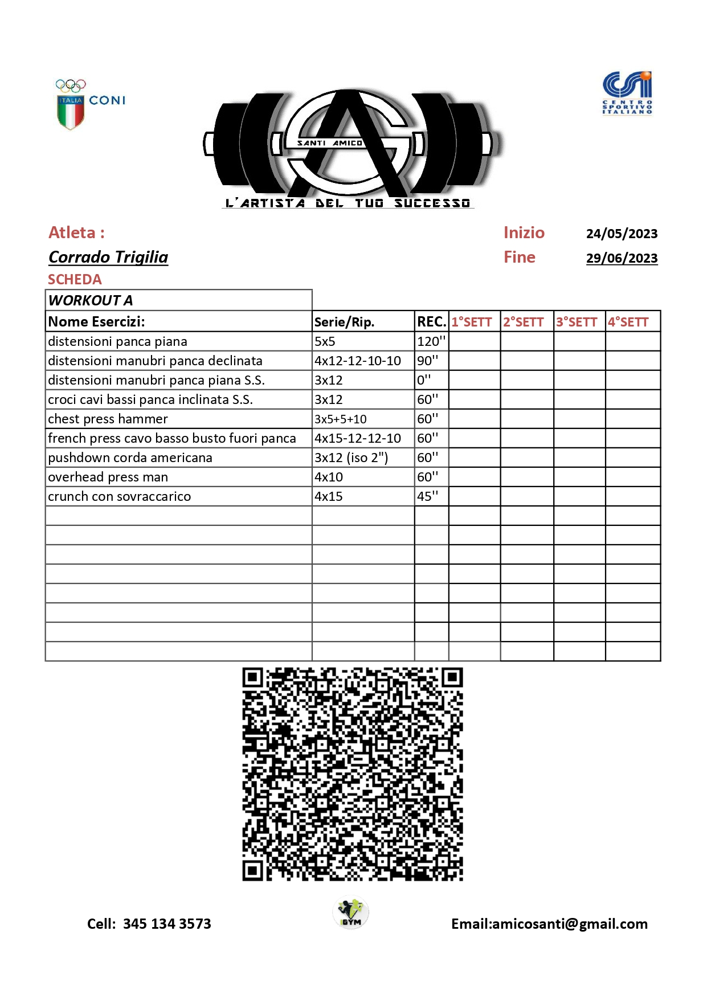

# IGym

IGym è un'applicazione per la gestione delle schede di allenamento in palestra.

## Funzionalità Principali
- #GestioneAllenamento
- #SchedePalestra
- #EserciziFitness

## Dettagli
- #AppFitness
- #GymLife
- #AllenamentoPersonalizzato
- #DatabaseEsercizi
- #GestioneSerieERipetizioni

## Tecnologie
- #MobileApp
- #Android
- #UserExperience
- #DesignIntuitivo

## Esempio Scheda di Allenamento

