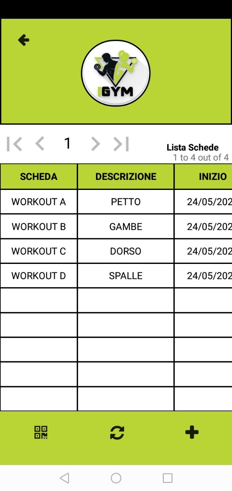
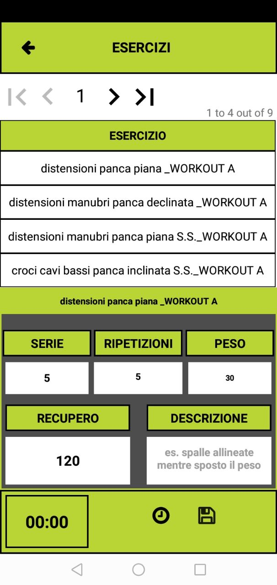

# IGym

IGym è un'applicazione per la gestione delle schede di allenamento in palestra.

## Funzionalità Principali
- #GestioneAllenamento
- #SchedePalestra
- #EserciziFitness

## Dettagli
- #AppFitness
- #GymLife
- #AllenamentoPersonalizzato
- #DatabaseEsercizi
- #GestioneSerieERipetizioni

## Tecnologie
- #MobileApp
- #Android
- #UserExperience
- #DesignIntuitivo

## Scheda di Allenamento

## App logo

## App pic 1

## App pic 2

## App pic 3

